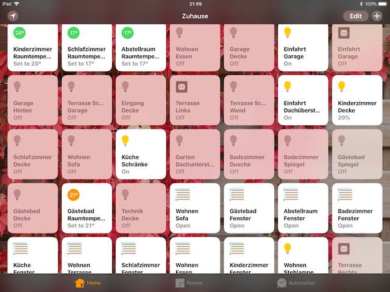

[Install Homebridge]: https://github.com/nfarina/homebridge#installation
[Install Busch-Jaeger API]: https://github.com/henry-spanka/home
[Configuration]: #Configuration

[sstadlberger]: https://github.com/sstadlberger
[Home Hub]: https://support.apple.com/en-us/HT207057


# Homebridge-Buschjaeger

Homebridge platform plugin for Busch-Jaeger SmartHome devices.



# Features
* Control your Busch-Jaeger Lights, Outlets, Blinds and more with Apple devices with Homekit
* Setup automations with the HomeKit UI
* Ask Siri to control your devices

# Supported devices
- Dimmaktor 4-fach (1021)
- Dimmaktor 4-fach (101C)
- Raumtemperaturregler (1004)
- Sensor/ Schaltaktor 8/8fach, REG (B008)
- Jalousieaktor 4-fach, REG (B001)
- Sensor/ Jalousieaktor 2/1-fach (1015)
- Sensor/ Jalousieaktor 1/1-fach (1013)
- Sonos Media Player (0001)

# Requirements
* Busch-Jaeger Access Point
* A linux-based server on your home network that runs 24/7 like a Raspberry Pi.
* Busch-Jaeger API running

# Setup / Installation
1. [Install Homebridge]
2. `npm install homebridge-buschjaeger`
3. [Install Busch-Jaeger API]
4. Edit `config.json` and configure platform. See [Configuration](#configuration) section.
5. Start Homebridge
6. Star the repository ;)

# Configuration

To configure the plugin add the following json in the platform section in `config.json`.
```json
{
    "platform": "BuschJaegerSysAp",
    "sysIP": "<IP>",
    "updateInterval": 60,
    "mappings": {}
}
```

Replace `<IP>` with the IP where your Busch-Jaeger API is running (NOT the IP of the System Access Point). `localhost` or `127.0.0.1` is fine if it's running on the same server.

You can configure the *mappings* if you want to ignore an actuator or channel if they are not connected/unused to hide them from the HomeKit UI.

```json
{
    "platform": "BuschJaegerSysAp",
    "sysIP": "<IP>",
    "updateInterval": 60,
    "mappings": {
        "<ACTUATOR-SERIAL>": {
            "blacklist": ["ch0000", "ch0001"],
        },
        "<ACTUATOR-SERIAL>": {
            "blacklist": ["*"],
        },
    }
}
```

You can find the actuator serial in the web interface of the Busch-Jaeger SysAp Interface.

# Limitations
* The door can not be controlled with HomeKit as the bus is not connected to the SysAp.
* The door camera can not be accessed. You may want to use IP cameras that are compatible with
other HomeBridge plugins.

# Notes
* The accessories can only be controlled when you're at home in your local WiFi network.
To manage your accessories remotely you need to setup an iPad/Homepod or Apple TV as a [Home Hub].

# Tips & Tricks
* Do not restart Homebridge if you are either updating the SysAp or an actuator as the accessory may be removed from
HomeKit if it is not detected during discovery.
* If the HomeKit UI does not respond to manual changes (switch pressed) or the accessory doesn't update itself try to
disable myBuschJaeger and re-enable it in the SysAp Webinterface.

# Changelog
The changelog can be viewed [here](CHANGELOG.md).

# Upgrade Notes
Upgrade Notes can be found in the [CHANGELOG](CHANGELOG).

# Help
If you have any questions or help please open an issue on the GitHub project page.

# Contributing
Pull requests are always welcome. If you have a device that is not supported yet please open an issue or open a pull request with
your modifications.

# License
The project is subject to the MIT license. A copy can be found in the root directory of the project [LICENSE](LICENSE).

# Thanks
Special thanks to [sstadlberger] for his effort to make a custom API interface for Busch-Jaeger.
